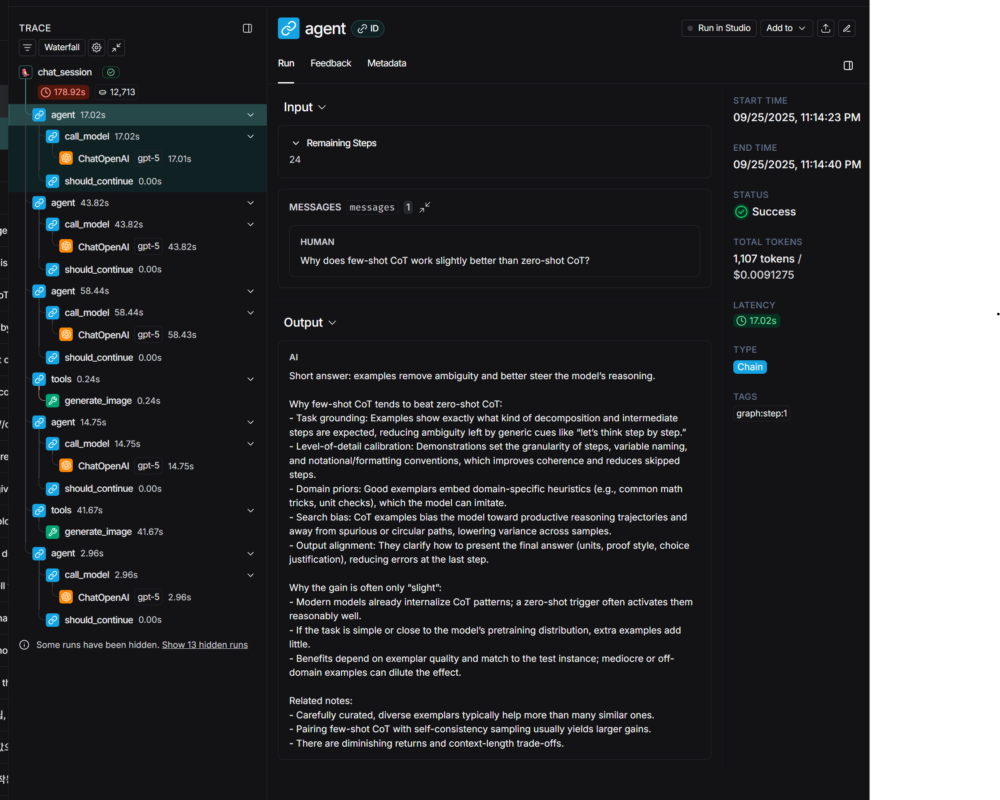

# Langchain-Chatbot
## Prerequisites

First. install neceessary packages:

```bash
pip install -qU "langchain[openai]"
pip install "langchain-core"
pip install "langgraph>0.2.27"
```

Then, set proper environment variables to call Langsmith trace.

These instructions are for Linux
```bash
export LANGSMITH_TRACING=true
export LANGSMITH_ENDPOINT=https://api.smith.langchain.com
export LANGSMITH_API_KEY=<your-api-key>
export LANGSMITH_PROJECT=<your-project-name>
export OPENAI_API_KEY=<your-openai-api-key>
```

## Description
This demo is a langchain chatbot using gpt-5, which is the latest model of OpenAI.  

It has 3 functions.
1. If input text sequence is given, it gives an output sequence.
2. If input text requires image output or outputting image data is necessary, it generates an image.
3. It has temporary memory that memorizes current session's conversation.


## Langsmith

The demo's langsmith trace link: https://smith.langchain.com/public/b9fcd8c7-4abf-4e1b-9a5e-1d4942927346/r




## Possible code modification for practical use

In current code, input sequence is hard coded. 
```bash
print(ask("Why does few-shot CoT work slightly better than zero-shot CoT?", session_id))
print(ask("How about training LLM into a model that answer in CoT way automatically when they solve inference problem? So that Users do not have to use CoT prompt every time when they solve inference problem", session_id))
print(ask("Summarize the second answer into a simple image without any letters.", session_id))
```

You can change it into an interactive mode:
```bash
while True:
    user_message = input("User: ") 
    if user_message.lower() in ["quit", "exit"]:
        break
    response = ask(user_message, session_id="demo")
    print("Chatbot:", response)
```
